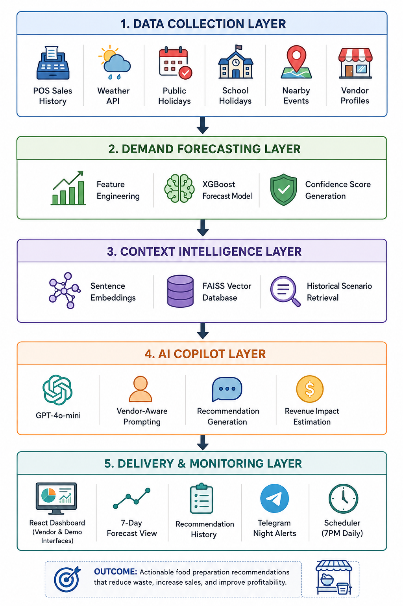

# 🍜 Hawker Copilot

> AI-powered operational copilot for Singapore hawkers and micro-F&B businesses.

🍜 Hawker Copilot — AI Operational Forecasting System

AI-native operational copilot for Southeast Asian hawkers and micro-F&B businesses, designed to reduce overproduction, improve profit margins, and stabilise daily food preparation decisions using contextual demand intelligence.This is done by predicting daily demand using a 3-layer AI architecture — combining machine learning forecasting, semantic retrieval, and LLM reasoning.


## 🎥 Demo Video

[](https://www.youtube.com/watch?v=d-tf8ZmiZ_k)

🚀 Project Purpose

Hawker Copilot is designed to solve operational inefficiency in small F&B businesses, especially hawkers and independent food vendors who lack data-driven planning tools.Unlike large franchises with analytics teams and inventory systems, small vendors rely heavily on intuition — leading to inconsistent preparation decisions and avoidable losses.

This system introduces an AI-assisted preparation workflow that helps vendors decide how much to cook each day using real-world signals such as:

POS sales history
Weather conditions
Public holidays and school holidays
Location-based demand patterns
Traffic and event-driven demand shifts

The system runs in shadow mode first, benchmarking AI recommendations against real vendor decisions before gradually enabling automated nightly alerts via messaging platforms.


⚠️ Problem Statement

Small and micro F&B businesses face three core structural challenges:
1. Thin margins & high waste sensitivity
Overpreparing even 10–20 portions can significantly reduce daily profit. Cannot afford to hire analytics team

2. Highly volatile demand
Demand is influenced by: Weather changes (rain spikes delivery demand),Office / CBD traffic cycles, Public holidays & school holidays, and Local events and seasonal patterns

3. Low digitalisation
Most hawkers rely on: intuition,experience,and rough estimation

This leads to:
sell-outs too early (lost revenue)
excess unsold food (waste loss)


📊 Current Industry Gap

Large delivery platforms and enterprise systems already provide macro-level insights:
“CBD lunch demand expected +18% due to office return trend. Chinese rice dishes +22%, Western meals +12%. Rain probability 60% may shift +8% demand to delivery.”

However, these insights are: too broad, not actionable for individual stalls, and not tied to exact preparation quantities


🤖 Our Solution
Instead of general trends, Hawker Copilot provides vendor-specific, actionable recommendations through automated chatbot messages that sends @7pm the day before preparation date:

## 📱 Telegram Alert Preview

🍜 HAWKER COPILOT — Prep Alert
━━━━━━━━━━━━━━━━━━━━━━━
🏪 Ah Kow Chicken Rice
📆 Tomorrow: Friday, 15 Aug 2025
📊 AI Recommendation
Prepare 78 portions of Chicken Rice
💪 Confidence: 82% (HIGH)
💰 Revenue Estimate
• Expected: $319
• AI saves you: ~$45 today
⚠️ Risk Assessment
🟢 Waste Risk: LOW
🟢 Shortage Risk: LOW
━━━━━━━━━━━━━━━━━━━━━━━
Powered by Hawker Copilot AI 🤖

---

Key Design Principle
👉 The AI acts as an assistant, not an enterprise ERP system
👉 Recommendations are simple, interpretable, and operationally actionable

🛠️ Tech Stack
Backend: FastAPI, Python 3.11, Pydantic (REST APIs)
Machine Learning (Forecasting): XGBoost, scikit-learn, feature engineering (weather, holidays, events, payday cycles)
Retrieval-Augmented Generation (RAG): FAISS, sentence-transformers (all-MiniLM-L6-v2)
LLM / AI Copilot: OpenAI GPT-4o-mini (vendor-aware reasoning, recommendation generation, confidence scoring)
Frontend: React 18, Vite, Tailwind CSS, Recharts
Infrastructure & Orchestration:APScheduler (nightly jobs), Telegram Bot API (alerts), SQLite (persistence)


🧠 System Overview
┌──────────────────────────────────────────────────────────┐
│                    HAWKER COPILOT                        │
├──────────────────────────────────────────────────────────┤
│                                                          │
│  LAYER 1 — Demand Forecast Engine                        │
│  XGBoost regression model                                │
│  20 Singapore-specific demand features                   │
│  Weather · holidays · payday cycles · events             │
│                        ↓                                 │
│  LAYER 2 — Context Retrieval (RAG Layer)                 │
│  FAISS vector database                                   │
│  Historical demand pattern matching                      │
│  Similar scenario retrieval                              │
│                        ↓                                 │
│  LAYER 3 — AI Copilot Reasoning                          │
│  GPT-4o-mini                                             │
│  Vendor-aware prompting                                  │
│  Converts predictions → actionable prep advice           │
│                                                          │
└──────────────────────────────────────────────────────────┘


## 🏗️ System Architecture




1. Data Ingestion Layer

The system aggregates multi-signal operational data to simulate real-world hawker demand conditions, including:

POS sales history (synthetic, vendor-calibrated)
Weather data (OpenWeatherMap API)
Public & school holidays (Singapore calendar data)
Event signals (curated local events dataset)
Derived patterns (payday cycles, monsoon seasonality)

These inputs form the foundation for demand forecasting and downstream AI reasoning.

2. Demand Forecasting Layer (Machine Learning Core)

A machine learning forecasting engine predicts daily vendor demand using:

XGBoost regression model
20+ Singapore-specific engineered features
Weather + event + temporal demand signals
Vendor-specific historical patterns

This layer outputs:

Predicted portion demand
Confidence score signals
Feature-level contribution signals

3. Context Retrieval Layer (RAG Intelligence)

A semantic retrieval system enhances forecasting context using historical similarity matching:

FAISS vector database for fast similarity search
Sentence-transformer embeddings (MiniLM)
Retrieval of past demand scenarios
Pattern matching for similar operational conditions

This layer grounds predictions in historical operational memory.

4. AI Copilot Reasoning Layer (LLM Intelligence)

An LLM-based reasoning engine converts structured predictions into actionable vendor advice:

OpenAI GPT-4o-mini
Vendor-aware prompt engineering
Fusion of forecast + retrieved context
Generates operational recommendations

Outputs include:

Suggested preparation quantities
Revenue and waste impact estimates
Risk assessment (shortage vs overproduction)
Plain-English decision guidance

5. Scheduling & Notification Layer

A background orchestration system automates daily operational delivery:

APScheduler (nightly 7PM SGT triggers)
Vendor-specific recommendation generation
Telegram Bot API for message delivery
Manual trigger endpoints for testing/demo mode

This layer simulates real-world autonomous AI assistant behavior.

6. Persistence & Analytics Layer

All operational outputs are stored for traceability and continuous improvement:

SQLite database for vendor + recommendation history
Structured logging of AI outputs
Scenario archives for retrieval layer
Queryable historical decision records

7. Visualization Layer (Frontend Dashboard)

A React + Vite dashboard provides real-time system interaction and monitoring:

Demand forecasting visualisation (7-day view)
AI recommendations with confidence scores
Retrieval explanations (similar past cases)
Vendor history tracking
Demo mode showing full 3-layer pipeline execution
🧠 Design Philosophy

The system is built as a lightweight, interpretable AI copilot rather than an enterprise ERP system


## ✨ Features

- **Demand Forecasting** — XGBoost model trained on vendor-specific synthetic POS data with 20 Singapore-specific features
- **RAG Retrieval** — FAISS vector store finds historically similar demand scenarios using semantic embeddings
- **AI Recommendations** — GPT-4o-mini synthesizes forecast + retrieval into plain-English prep advice
- **Confidence Scoring** — Weighted scoring system (retrieval quality, sales stability, weather certainty)
- **Revenue Estimation** — Projects expected revenue and waste savings vs gut-feel overpreparation
- **Telegram Alerts** — Automated nightly prep alerts sent to vendors at 7PM SGT
- **5 Vendor Profiles** — Preloaded Singapore hawker stalls across heartland, CBD, tourist, and suburban areas
- **Vendor Registration** — Self-onboarding form for new vendors (Option B)
- **7-Day Forecast Chart** — Week-ahead demand visualization with confidence bands
- **Demo Mode** — Shows all 3 AI layers working in real time for judges/investors
- **SQLite Persistence** — Recommendation history saved and queryable per vendor
- **Scheduled Alerts** — APScheduler fires nightly at 19:00 SGT across all registered vendors

---

## 🗂️ Project Structure
hawker-copilot/
├── backend/
│   ├── api/routes/          # FastAPI endpoints
│   │   ├── copilot.py       # /copilot/recommend
│   │   ├── forecast.py      # /forecast/predict
│   │   ├── forecast_week.py # /forecast/week (7-day)
│   │   ├── retrieval.py     # /retrieval/similar
│   │   ├── vendors.py       # /vendors/ CRUD
│   │   ├── history.py       # /history/
│   │   └── scheduler.py     # /scheduler/trigger
│   ├── copilot/             # Layer 3 — LLM
│   │   ├── advisor.py       # Pipeline orchestrator
│   │   ├── llm_client.py    # OpenAI wrapper
│   │   ├── prompt_builder.py
│   │   ├── schemas.py
│   │   └── telegram_notifier.py
│   ├── core/                # Layer 1 — Forecast
│   │   ├── data_ingestion.py
│   │   ├── events.py        # SG holidays + events
│   │   ├── feature_engineering.py
│   │   ├── forecaster.py    # XGBoost + confidence
│   │   ├── schemas.py
│   │   └── vendor_profiles.py
│   ├── intelligence/        # Layer 2 — Retrieval
│   │   ├── embedder.py
│   │   ├── retriever.py
│   │   ├── schemas.py
│   │   └── vector_store.py
│   ├── database/
│   │   └── db.py            # SQLite
│   ├── scheduler.py         # APScheduler
│   ├── config.py
│   └── main.py
├── frontend/
│   └── src/
│       └── App.jsx          # React dashboard
├── data/                    # Auto-created at runtime
└── models/                  # Auto-created at runtime


---

## 🚀 Quick Start

### Prerequisites
- Python 3.11+
- Node.js 18+
- OpenAI API key
- Telegram Bot token (optional)

### Backend Setup

```bash
cd backend
python -m venv venv

# Windows
venv\Scripts\activate

# Mac/Linux
source venv/bin/activate

pip install -r requirements.txt
```

Create `backend/.env`:
```env
OPENAI_API_KEY=your_openai_key_here
WEATHER_API_KEY=your_openweathermap_key_here
TELEGRAM_BOT_TOKEN=your_telegram_bot_token
TELEGRAM_CHAT_ID=your_telegram_chat_id
APP_ENV=development
MODEL_PATH=models/forecaster.pkl
WEATHER_CITY=Singapore
```

Start backend:
```bash
# From project root
$env:PYTHONPATH = "C:\path\to\Hawker Copliot"  # Windows
export PYTHONPATH="/path/to/Hawker Copliot"     # Mac/Linux

uvicorn backend.main:app --reload --reload-dir backend --port 8000
```

### Frontend Setup

```bash
cd frontend
npm install
npm run dev
```

Open `http://localhost:5173`

---

## 🧪 API Endpoints

| Method | Endpoint | Description |
|--------|----------|-------------|
| POST | `/api/v1/copilot/recommend` | Full 3-layer pipeline |
| POST | `/api/v1/forecast/week` | 7-day forecast |
| GET | `/api/v1/vendors/` | List all vendors |
| POST | `/api/v1/vendors/register` | Register new vendor |
| GET | `/api/v1/vendors/{id}/history` | Vendor recommendation history |
| POST | `/api/v1/retrieval/similar` | Layer 2 retrieval only |
| POST | `/api/v1/scheduler/trigger/nightly` | Trigger all vendor alerts |
| POST | `/api/v1/scheduler/trigger/vendor/{id}` | Trigger single vendor alert |
| GET | `/api/v1/scheduler/status` | Scheduler status |

Interactive docs: `http://localhost:8000/docs`

---

## 📊 Singapore Data Sources

| Signal | Source | Type |
|--------|--------|------|
| POS Sales | Synthetic (vendor-calibrated) | Simulated |
| Weather | OpenWeatherMap API | Real |
| Public Holidays | MOE/MOM SG calendar | Real (hardcoded) |
| School Holidays | MOE SG calendar | Real (hardcoded) |
| Major Events | Curated SG events list | Simulated |
| Payday Effect | End-of-month pattern | Derived |
| Monsoon Season | NEA seasonal data | Derived |

---

## 🤖 Demo Mode

Toggle **🔬 Demo Mode** in the dashboard to see:
- Layer 1 XGBoost predictions with feature importances
- Layer 2 FAISS retrieved scenarios with similarity scores
- Layer 3 GPT-4o-mini reasoning trace
- Confidence score breakdown by factor
- System architecture overview

---

## 🏪 Preloaded Vendors

| Vendor | Location | Area Type |
|--------|----------|-----------|
| Ah Kow Chicken Rice | Toa Payoh Lorong 8 | Heartland |
| Maxwell Wonton Noodle | Maxwell Food Centre | Tourist/CBD |
| Chinatown Laksa Queen | Chinatown Complex | Tourist |
| Bedok Nasi Lemak | Bedok Interchange | Heartland |
| Jurong West Char Kway Teow | Jurong West 505 | Suburban |

---

## 👨‍💻 Author

Built as a portfolio AI systems project demonstrating production-grade RAG architecture for real-world operational intelligence.